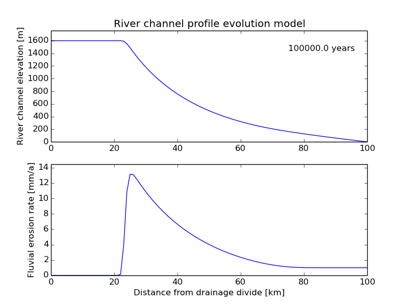

# Lab-exercise-4

## Sources
This tutorial is based on a MATLAB exercise from [Prof. Todd Ehlers (Uni Tübingen)](http://www.geo.uni-tuebingen.de/?id=2183) and [Prof. Brian Yanites (Uni Idaho)](https://www.uidaho.edu/sci/geology/people/faculty/byanites).

## Overview
For the exercises this week, we will be applying the advection equation to bedrock river erosion with a spatially variable advection coefficient (stream-power erosion). You are asked to modify an starter Python script to produce plots and to answer questions related to the plots. As before, we will be using **Spyder** for these exercises.

## Getting started
1. You can start by making a folder to store files for this week's exercises in a Terminal.

    ```bash
    $ cd Desktop
    $ mkdir Lab-4
    $ cd Lab-4
    ```
**Reminder**: the `$` symbol above represents the command prompt in the Terminal window.
2. Now you can open **Spyder**.

    ```bash
    $ spyder
    ```

Now we are ready to start.

## Problem 1 - Introduction to river profile evolution
For this exercise we will be using the Python script [`river_profiles.py`](river_profiles.py) to plot river profiles. The script performs all of the basic calculations needed to answer the questions below, but you will need to make some changes to the script to complete the exercise. To begin, download a copy the [`river_profiles.py`](river_profiles.py) file to your `Lab-4` directory and open it in **Spyder**.

### Part 1 - Examining the code
The program simulates river incision into a 100-km-wide landscape with an initial flat surface elevation of 1500 m. River incision is calculated using the stream-power erosion equations described in [Lecture 7](https://github.com/Intro-Quantitative-Geology/Lecture-slides/blob/master/07-Advection-of-the-Earths-surface/07-Advection-of-the-Earths-surface.pdf). For this part you should do the following:

1. Carefully read over the Python source code and comments. There are some new features in this code, so pay attention to where the variables are defined and used, how the initial topography is defined, how the upstream drainage basin area is calculated, how surface elevation is calculated and how the results are plotted.
2. Without making any changes, run the program and save a copy of the plot it produces. The program will take about 1 minute to run. **Add your plot at the end of your version of this document and include a figure caption explaining what the plot shows**.
3. Look again through the Python code and the plot it produces. Answer the following questions in the space beneath the plot and caption you've inserted.
  - **How long is the time step in the calculation?**
  - **What is the rock uplift rate in the model? Is it constant or does it vary with space in the model?**
  - **What is the maximum elevation of the topography at the end of the simulation? Is this higher or lower than the original maximum elevation? Why?**
  - **Does the maximum elevation continually increase with time, or does it also decrease? Why might this be? Does the river profile appear to reach a steady state?**
  - **How fast (at what velocity) does the drainage divide (highest point in the topography) migrate across the model?** To calculate this value, you should run the model several times for shorter simulation times, note the position of the divide at the completion of the simulation and then calculate the velocity (distance travelled divided by time).

### Part 2 - Subplots and erosion rates
This program calculates erosion rates across the length of the channel as a function of time in order to update the topography at the end of each time step. Currently, the program only plots the topography. For this part of the exercise, your goal is to plot both the topography and erosion rates on separate plots. This can be done using the `plt.subplot()` function to add a second plot beneath the existing plot. Currently, the first plot is created in the Python script using the commands

```python
# Format subplot 1
axis1 = plt.subplot(1,1,1)                  # Set axis1 as the first plot
axis1.set_xlim([0.0, max(xkm)])             # Set the x-axis limits for plot 1
axis1.set_ylim([0.0, max_elevation*1.1])    # Set the y-axis limits for plot 1
plot1, = plt.plot(xkm, topography)          # Define plot1 as the first plot
plt.xlabel("Distance from drainage divide [km]")
plt.ylabel("River channel elevation [m]")
plt.title("River channel profile evolution model")
```

This is slightly different than past plots for two reasons. First, we would like to have multiple plots in one window. Second, to update the plot in an animation in the plot window, we need to define a variable to refer to the plot frame (`axis1`) and the line that will be plotted (`plot1`). Here, by using `plt.subplot()` function, we have allowed ourselves to potentially have several plots in one window, but it is set to only have one plot. The syntax for the `plt.subplot()` command is `plt.subplot(nrows, ncols, plot number)`, where `nrows` is the number of rows of plots, `ncols` is the number of columns of plots and `plot number` is the number of the plot in the list. Currently, we have 1 row, 1 column and 1 plot to display. Note that we have also defined the axis limits separately so they can be updated in the animation. For this part, you should:

1. First increase the number of rows to two for the first plot, then add the code necessary to generate a second plot similar to the example for plot 1. The second plot should be below the first plot and show the erosion rate **in mm/a** across the river profile with proper axis labels.

    :heavy_exclamation_mark: **NOTE**: Because the coordinate system for elevation is positive upwards, you should multiply the erosion rates that are calculated by -1 so that they are positive values.<br/><br/>
If you run your simulation for 100,000 years, you should see something like the following plot:

    <br/>
    *Figure 1. An example of using the `plt.subplot()` function. Your plot should look like this.*

2. **Add your plot at the end of your version of this document and include a figure caption**.
3. Run the program with a rock uplift rate of 1 mm/a and answer the following questions below the plot you've just inserted:
  - **What are the fastest erosion rates your see in your river profile?**
  - **Do the fastest erosion rates always occur in the same place, or does the location of fastest erosion change?** Explain why this occurs, based on the equations for stream-power erosion presented in Lecture 7.
4. Rerun the program with a rock uplift rate of 3 mm/a and answer the following questions at the end of your version of this document:
    - **What is the maximum elevation you observe in the model after 100,000 years now?**
    - **What is the maximum erosion rate in the model after 100,000 and 2,000,000 years? Does the river profile reach an equilibrium elevation?**

### Part 3 - Sloping initial topography
Modify the program so that it now uses an initial topography that is sloping rather than flat. This feature is already available in the code, but you will need to locate it and change the corresponding variable in order to use sloping initial topography. Rerun the program and perform the following steps:

1. **Save the plot that is generated after 2,000,000 years with a rock uplift rate of 1 mm/a, insert a copy at the end of your version of this document and include a figure caption**.
2. **Explain how fast (at what velocity) the drainage divide migrates back into the initial topographic surface**. As before, you may want to run several shorter simulations to calculate the position of the divide at various times in order to find a velocity (distance over time). **How fast is this velocity compared to that calculated in question 1?**
3. Look at the erosion rates across the profile. **Are the majority of the erosion rates greater than, less than or equal to the rock uplift rate? Based on this answer, is the topography in a steady state (i.e., not changing)?**

### Part 4 - The stream-power erosion law exponents
Change the initial topography back to a flat surface. In the stream-power erosion law, there are two important exponents (*m* and *n*) that will alter the efficiency of river erosion when varied. Change the values of *m* and *n* to the different values listed in the comments in the code and rerun the program for each pair of *m* and *n* values.

1. **Save a copy of each of the three plots that are generated and add them to the end of your version of this document including a figure caption**.
2. **Is the river channel profile sensitive to variations in *m* and *n*?**

### Part 5 - Non-uniform channel uplift
Change the values of *m* and *n* back to the original values (*m* = 1.0, *n* = 2.0). Currently, the program uses a constant rock uplift rate across the river profile. Modify the program to have a rock uplift rate of 5 mm/a when *x* ≤ 50 km, and an uplift rate of 1 mm/a when *x* > 50 km. This discontinuity is equivalent to placing an active fault along the river profile. Rerun the program and perform the following tasks:

1. **Save a copy of the plot that is generated and add it to the end of your version of this document along with a figure caption**.
2. Answer the following questions:
  - **Is the maximum topography higher or lower in this simulation compared to that in part 1 of this problem?**
  - **Does the river profile after 2 million years clearly show where the change in uplift rate occurs?**
  - **Does the plot of erosion rates clearly show where the change in uplift rate occurs as the profile evolves?**


## What to submit
**For this exercise, your modifications to the end of this document should include**

1. One plot each for Parts 1-3 and Part 5.
2. One plot for **each** combination of *m* and *n* values for Part 4.
3. A figure caption beneath **each** plot explaining what it shows as if it was in a scientific publication.
4. Answers to the questions in bold for Parts 1-5 inserted beneath the associated plots and captions in each Part.

# Answers
## Problem 1
This is some text. You can use *italics* or **bold** text easily. You may want to read a bit more about [formatting text in Github-flavored Markdown](https://help.github.com/articles/basic-writing-and-formatting-syntax/). You can see an example of how to display an image with a caption below.

<br/>
*Figure 2: Sine wave calculated from 0 to 2π*
